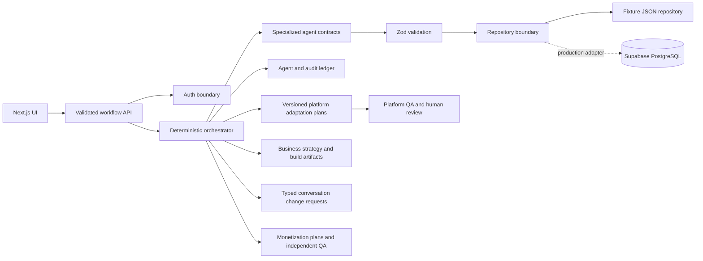

# Architecture

Channelwright separates deterministic workflow control from probabilistic agent work. The orchestrator owns eligibility, validation, persistence, retries, pausing, and state transitions. Agents receive typed input and return Zod-validated output; agents do not invoke one another.

## Boundaries

- `src/domain`: provider-independent schemas, actions, entities, and finite-state machines.
- `src/server/agents`: agent implementations. The current fixture adapter never represents itself as live research.
- `src/server/orchestrator.ts`: deterministic sequencing and human gate handling.
- `src/server/repository.ts`: persistence abstraction and atomic local fixture repository.
- `src/app/api`: authenticated, validated HTTP boundary with serialized writes and idempotency keys.
- `supabase/migrations`: production relational model and ownership policies.
- `src/features/studio`: client interface; it cannot mutate state except through validated workflow actions.
- `src/domain/platform-constraints.ts`: centralized, typed planning constraints and source provenance for short-form targets.
- `src/domain/studio-contracts.ts`: strict reference-research and business-studio artifact contracts.
- `src/domain/youtube-channel-url.ts`: allowlisted YouTube channel URL parsing and canonicalization; it performs no network fetch.
- `src/server/agents/reference-channel.ts`: deterministic fixture implementation and the interface required by a future live provider.
- `src/server/agents/product-builder.ts`: constrained specification and preview-manifest fixtures; it does not execute generated code.
- `src/server/agents/monetization.ts`: deterministic revenue-stream analysis and independent QA with explicit assumptions.
- Conversation input is translated into an existing typed workflow action. The successful mutation records a message and structured change request pointing to the resulting new version.

## Failure and retry behavior

Every mutation accepts an `Idempotency-Key`. Repeating the same key and input returns the current result without duplicating versions or runs. Reusing a key for different input returns HTTP 409. Agent errors are logged as failed and do not transition the entity. Fixture-file writes use temporary-file replacement to avoid partially written JSON.

The mock repository is a development adapter, not a multi-instance production store. The production Supabase repository and live research provider remain explicit gaps.

Build execution evidence is deliberately `NOT_RUN`. Isolated workspaces, dependency allowlists, secret scanning, static analysis, tests, resource limits, email delivery, object storage, payment-provider verification, and deployment are contracts or blockers in this slice, not locally executed capabilities.

Reference research follows the same boundary: the orchestrator owns resolution, sequencing, retry, QA, versioning, approval, and audit events. A provider can only return validated source and report contracts; it cannot approve a report, call another agent, or mutate persistence.

## Distribution sequencing

Channel defaults are copied into an immutable-per-video target snapshot at creation and included in the idempotency fingerprint and audit event. YouTube remains required. Optional child artifacts are created only after the exact canonical script version is approved. Because master rendering does not yet exist, these children are `ADAPTATION_PLAN` records with `sourceMasterVersion: null`; they cannot become export-ready or publish-ready.

TikTok and Reels artifacts have independent versions, QA, failures, and approvals. A rejected plan creates a new child version without rewriting its source script or sibling platform. The deterministic orchestrator owns eligibility and persistence; fixture optimizers cannot invoke each other or mutate canonical artifacts.
