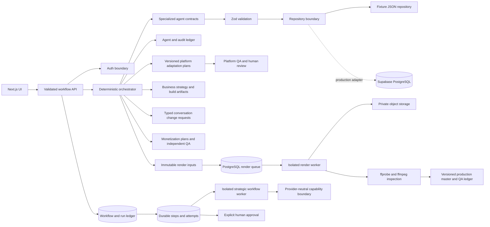

# Architecture

Channelwright separates deterministic workflow control from probabilistic agent work. The orchestrator owns eligibility, validation, persistence, retries, pausing, and state transitions. Agents receive typed input and return Zod-validated output; agents do not invoke one another.

## Boundaries

- `src/domain`: provider-independent schemas, actions, entities, and finite-state machines.
- `src/server/agents`: agent implementations. The current fixture adapter never represents itself as live research.
- `src/server/orchestrator.ts`: deterministic sequencing and human gate handling.
- `src/server/repository.ts`: persistence abstraction and atomic local fixture repository.
- `src/app/api`: authenticated, validated HTTP boundary with serialized writes and idempotency keys.
- `supabase/migrations`: production relational model and ownership policies in the isolated `channelwright` schema; unrelated shared-project `public` tables remain outside Channelwright.
- `src/features/studio`: client interface; it cannot mutate state except through validated workflow actions.
- `src/domain/platform-constraints.ts`: centralized, typed planning constraints and source provenance for short-form targets.
- `src/domain/studio-contracts.ts`: strict reference-research and business-studio artifact contracts.
- `src/domain/youtube-channel-url.ts`: allowlisted YouTube channel URL parsing and canonicalization; it performs no network fetch.
- `src/server/agents/reference-channel.ts`: deterministic fixture implementation and the interface required by a future live provider.
- `src/server/agents/product-builder.ts`: constrained specification and preview-manifest fixtures; it does not execute generated code.
- `src/server/agents/monetization.ts`: deterministic revenue-stream analysis and independent QA with explicit assumptions.
- `src/video`: provider-neutral render input, the Remotion root, and deterministic visual composition. Its built-in sample uses no external media or provider calls.
- `src/server/rendering`: separately started render worker, PostgreSQL and deterministic in-memory queue adapters, per-job asset resolution, Remotion rendering, actual media inspection, technical QA, and bounded workspace cleanup.
- `src/server/media`: provider-neutral storage, asset/provider contracts, content sniffing, owner-key validation, checksum verification, ingestion, and production/fixture media repositories.
- `src/domain/production-workflows.ts`: typed workflow registry, versioned input/output contracts, step dependencies, capability names, retry policies, and approval gates.
- `src/server/workflows`: the authenticated repository, isolated service-role worker, and provider-neutral step executor boundary. Route handlers do not contain agent or state-machine logic.
- `src/app/api/media/assets`: authenticated bounded upload ingestion. It accepts bytes, provenance, and rights metadata; it does not expose a remote URL fetcher.
- `src/app/api/media/assets/[versionId]/signed-url`: owner-checked, server-generated read URLs limited to 900 seconds. Local filesystem evidence never issues URLs.
- Conversation input is translated into an existing typed workflow action. The successful mutation records a message and structured change request pointing to the resulting new version.

## Failure and retry behavior

Every mutation accepts an `Idempotency-Key`. Repeating the same key and input returns the current result without duplicating versions or runs. Reusing a key for different input returns HTTP 409. Agent errors are logged as failed and do not transition the entity. Fixture-file writes use temporary-file replacement to avoid partially written JSON.

The mock repository is a development adapter, not a multi-instance production store. Existing legacy planning-agent actions still use it only. In production, media actions and registered strategic workflow starts use separate transactional PostgreSQL RPCs; unregistered legacy fixture actions continue to return capability-specific HTTP 501 responses. Neither production engine loads and rewrites an entire workspace snapshot.

## Strategic workflow consistency model

`Workflow` is the user-level objective. A `Workflow run` is one execution of a versioned definition. `Steps` are dependency-aware units of work or explicit approval gates. `Attempts` are lease-bound executions of worker steps. The registry declares type/version, strict input/output schemas, ordered dependencies, capability names, approval gates, and bounded retry policy.

Starting a workflow takes an owner-scoped idempotency key and input fingerprint under a transaction-level advisory lock. Workers claim eligible steps with `FOR UPDATE SKIP LOCKED`; the lease token—not the worker name—is the authority to heartbeat, fail, or complete. Expired leases become recorded attempts and either enter bounded `RETRY_WAIT` or fail the run at the maximum. Cancellation atomically ends outstanding attempts and steps, so stale workers cannot publish output. Direct authenticated inserts/updates are revoked; user transitions go through owner-validating RPCs and worker transitions require `service_role`.

Every transition appends a structured event identifying workflow, run, optional step/attempt, actor type, actor identifier, timestamp, and bounded non-secret detail. Durable context is a map of validated step outputs, not an unbounded prompt store. AI/provider execution sits behind capability-specific executors so the workflow engine does not know which future model implements `strategist`, `researcher`, or `monetization-strategist`.

Each workflow type declares one canonical finalizer whose output becomes the run's durable `output_payload`: `synthesize-validation` for `CHANNEL_CONCEPT_VALIDATION` and `CHANNEL_RESEARCH`, `finalize-strategy` for `CHANNEL_STRATEGY`, `finalize-content-intelligence` for `CHANNEL_CONTENT_INTELLIGENCE`, `finalize-video-brief` for `CHANNEL_VIDEO_BRIEF`, and `finalize-video-script` for `CHANNEL_VIDEO_SCRIPT`. Promotion is keyed on the run's type, so intermediate steps never become the final artifact. Paid workflows are additionally rate-bounded in the database: one active research run per owner, one active strategy run per owner and approved research run, one active content-intelligence run per owner and approved strategy run, one active video-brief run per owner, approved content run, and selected topic, and one active video-script run per owner and approved video-brief run.

## Evidence chain and the Viewer Value invariant

The five provider-backed workflows form one provenance chain. `CHANNEL_RESEARCH` establishes whether a channel opportunity is real; `CHANNEL_STRATEGY` consumes one exact approved research artifact and decides how the channel competes; `CHANNEL_CONTENT_INTELLIGENCE` consumes one exact approved strategy artifact and decides what to make next; `CHANNEL_VIDEO_BRIEF` consumes one exact approved content-intelligence artifact plus one eligible topic and decides what that single video must accomplish and how production should deliver it (see `docs/video-brief.md`); `CHANNEL_VIDEO_SCRIPT` consumes one exact approved video-brief artifact and produces the timed, evidence-disciplined script for that single video. Each downstream workflow resolves its upstream artifact through a database-authoritative RPC, persists an immutable reference, and re-verifies that reference before any model use. Each reference transitively carries its own upstream reference, so the whole research -> strategy -> content -> brief -> script chain remains queryable from the final artifact.

AI execution sits behind a provider-neutral boundary (`src/server/ai`). Workflow code asks for a capability and a role; a server-controlled role router resolves the vendor. CONTENT_INTELLIGENCE generates on one provider and is critiqued and QA'd by another, with Channelwright arbitrating deterministically. See [the multi-model architecture](multi-model-architecture.md).

`src/domain/viewer-value.ts` defines a stage-agnostic Viewer Value contract, assessment, and gate that every recommendation must satisfy, plus a `viewerValueProvenance` record carrying a canonical contract hash so later stages can detect value drift rather than assume it away. See [the Viewer Value doctrine](viewer-value-doctrine.md).

## Media consistency model

- Upload bytes enter a fixed private bucket through trusted server code. Temporary objects are verified and cleaned; immutable content-addressed objects are never overwritten.
- A database asset version is recorded only after byte count, content sniffing, SHA-256, and technical inspection succeed. Rights status is independent metadata; only `VERIFIED` assets resolve for rendering.
- `CREATE_RENDER_JOB` verifies owner, exact approved script, render-input fingerprint, and every referenced asset inside a transaction. Advisory locks serialize idempotency keys and `FOR UPDATE` serializes per-video version allocation.
- Workers claim with `FOR UPDATE SKIP LOCKED`. Lease tokens, heartbeats, expiry recovery, attempts, exponential retry delay, cancellation, and final failure live in PostgreSQL.
- The worker uses a job-named workspace under a configured root. It downloads each private object, verifies checksum and size, renders, probes the actual output, uploads a content-addressed master, and calls one atomic completion RPC.
- `production_master_versions.render_job_id` is unique. A retried completion returns the original master rather than publishing a second version.
- Technical, rights, content, visual, audio, and platform QA remain separate. Automated audio measurements do not pass subjective audio QA. Unknown or unperformed gates keep the master `QA_BLOCKED`.

Build execution evidence is deliberately `NOT_RUN`. Isolated workspaces, dependency allowlists, secret scanning, static analysis, tests, resource limits, email delivery, object storage, payment-provider verification, and deployment are contracts or blockers in this slice, not locally executed capabilities.

Reference research follows the same boundary: the orchestrator owns resolution, sequencing, retry, QA, versioning, approval, and audit events. A provider can only return validated source and report contracts; it cannot approve a report, call another agent, or mutate persistence.

## Distribution sequencing

Channel defaults are copied into an immutable-per-video target snapshot at creation and included in the idempotency fingerprint and audit event. YouTube remains required. Optional child artifacts are created only after the exact canonical script version is approved. A deterministic local master-render proof now exists, but it is not connected to workflow persistence and does not create a versioned production master. Existing children therefore remain `ADAPTATION_PLAN` records with `sourceMasterVersion: null`; they cannot become export-ready or publish-ready.

TikTok and Reels artifacts have independent versions, QA, failures, and approvals. A rejected plan creates a new child version without rewriting its source script or sibling platform. The deterministic orchestrator owns eligibility and persistence; fixture optimizers cannot invoke each other or mutate canonical artifacts.
