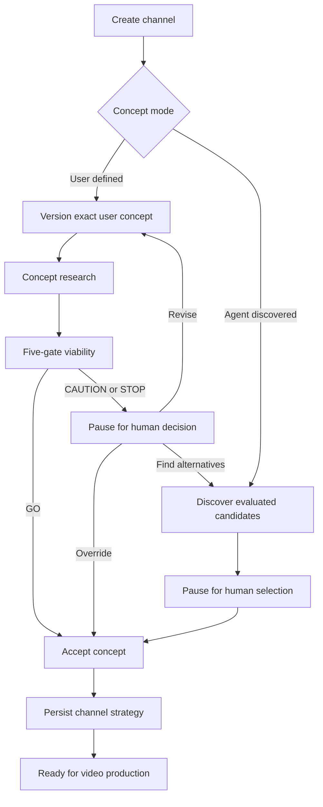

# Channel concept workflow

The five gates are content runway, proven audience demand, monetization path, differentiation, and production economics. The first three are hard gates: GO requires affirmative evidence for each. The strategic gates affect ranking and can reduce an otherwise eligible concept to CAUTION.

CAUTION and STOP_RECOMMENDED are advisory and always pause. An override records both the original system recommendation and the separate human decision. Revision adds a new concept version; it never overwrites prior research. Alternative discovery reuses channel preferences and requires explicit candidate selection.

Fixture mappings make every branch reproducible:

- Most concepts: GO
- A concept containing `Failed Startup` or `Fixture caution`: CAUTION
- A concept containing `Daily AI News`, `Celebrity News`, or `Fixture stop`: STOP_RECOMMENDED

Fixture reports are contract demonstrations, not market forecasts.
