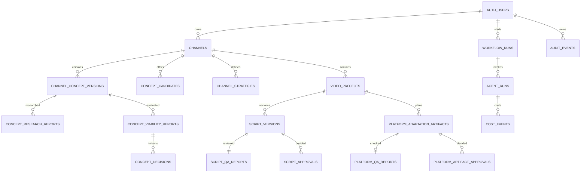

# Data model

The Supabase migrations begin with `supabase/migrations/202608080001_initial_channelwright.sql` and are extended by forward-only distribution and business-studio migrations.

All user-owned tables enable RLS. Direct anonymous table access is revoked. Policies match `auth.uid()` to the channel or video owner, including child records through ownership joins. Human decisions store `created_by`; service-role credentials are server-only and are not part of the browser environment. Agent runs and audit events carry an explicit owner so operational history cannot become a cross-tenant side channel.

The fixture adapter stores the equivalent aggregate as JSON for local demonstration. It does not replace PostgreSQL for production concurrency, backups, or multi-instance operation.

## Distribution records

`channels.distribution_targets` stores validated defaults and `video_projects.distribution_targets` stores the creation-time snapshot. Missing fields in pre-feature fixture records normalize to `{ youtube: true, tiktok: false, instagramFacebookReels: false }`.

The forward migration `supabase/migrations/202608090001_platform_distribution.sql` adds normalized `platform_adaptation_artifacts`, `platform_qa_reports`, and `platform_artifact_approvals`. Artifacts retain platform, version, approved source-script version, nullable source-master version, honest artifact kind, status, fixture flag, package payload, and future media-reference fields. Large binaries do not belong in JSON or PostgreSQL; future render adapters must store stable object-storage references and inspected media metadata.

All three child tables enable RLS. Policies resolve ownership through `video_projects.owner_id = auth.uid()`; approval rows additionally require `created_by = auth.uid()`.

## Business-studio foundation

`supabase/migrations/202608100001_business_studio_foundation.sql` adds reference source/report/decision records plus normalized tables for later strategy, build, funnel, commerce, monetization, and conversation slices. Every mutable row stores `owner_id`; channel-linked rows use composite channel/owner foreign keys; decision records bind exact versions and require `created_by = owner_id`; all new tables enable RLS.

Generated binaries are represented by durable object references and metadata, never stored in JSON or PostgreSQL byte payloads. Subscriber, consent, delivery, purchase, and entitlement rows are separate so audit and revocation histories are not overwritten.

The fixture aggregate also persists owner-scoped `conversationMessages` and `changeRequests`. A conversational revision records the user's instruction only after the typed workflow action succeeds and links the request to the newly created artifact version. It does not overwrite the prior version.
