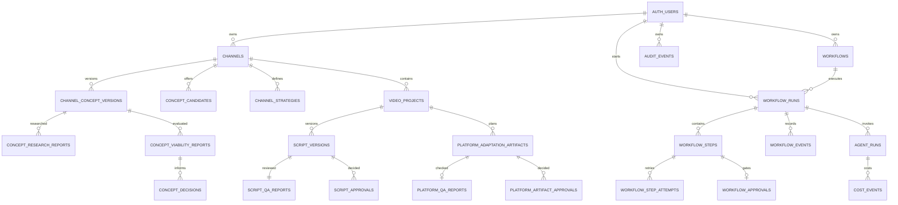

# Data model

The Supabase migrations begin with `supabase/migrations/202608080001_initial_channelwright.sql` and are extended by forward-only distribution, business-studio, and media migrations. All Channelwright relational objects live in the dedicated `channelwright` schema so the shared project's existing `public` applications remain isolated.

All user-owned tables enable RLS. Direct anonymous table access is revoked. Policies match `auth.uid()` to the channel or video owner, including child records through ownership joins. Human decisions store `created_by`; service-role credentials are server-only and are not part of the browser environment. Agent runs and audit events carry an explicit owner so operational history cannot become a cross-tenant side channel.

The fixture adapter stores the equivalent aggregate as JSON for local demonstration. It does not replace PostgreSQL for production concurrency, backups, or multi-instance operation.

## Distribution records

`channels.distribution_targets` stores validated defaults and `video_projects.distribution_targets` stores the creation-time snapshot. Missing fields in pre-feature fixture records normalize to `{ youtube: true, tiktok: false, instagramFacebookReels: false }`.

The forward migration `supabase/migrations/202608090001_platform_distribution.sql` adds normalized `platform_adaptation_artifacts`, `platform_qa_reports`, and `platform_artifact_approvals`. Artifacts retain platform, version, approved source-script version, nullable source-master version, honest artifact kind, status, fixture flag, package payload, and future media-reference fields. Large binaries do not belong in JSON or PostgreSQL; future render adapters must store stable object-storage references and inspected media metadata.

All three child tables enable RLS. Policies resolve ownership through `video_projects.owner_id = auth.uid()`; approval rows additionally require `created_by = auth.uid()`.

## Business-studio foundation

`supabase/migrations/202608100001_business_studio_foundation.sql` adds reference source/report/decision records plus normalized tables for later strategy, build, funnel, commerce, monetization, and conversation slices. Every mutable row stores `owner_id`; channel-linked rows use composite channel/owner foreign keys; decision records bind exact versions and require `created_by = owner_id`; all new tables enable RLS.

Generated binaries are represented by durable object references and metadata, never stored in JSON or PostgreSQL byte payloads. Subscriber, consent, delivery, purchase, and entitlement rows are separate so audit and revocation histories are not overwritten.

The fixture aggregate also persists owner-scoped `conversationMessages` and `changeRequests`. A conversational revision records the user's instruction only after the typed workflow action succeeds and links the request to the newly created artifact version. It does not overwrite the prior version.

## Production workflow records

`202608130001_production_workflow_engine.sql` extends the legacy `workflow_runs` ledger and adds `workflows`, `workflow_steps`, `workflow_step_attempts`, `workflow_approvals`, and `workflow_events`. New runs retain versioned input, bounded durable context, typed output, idempotency fingerprint, legal status, completion/error metadata, and an owner composite key. Step rows hold dependencies, capability, state, retry limits, availability, lease ownership, and output. Attempts preserve each worker/lease execution instead of overwriting retry history.

Authenticated clients have owner-filtered read access. Direct write privileges are revoked for the workflow state tables. Authenticated `SECURITY DEFINER` entry points derive ownership from `auth.uid()` for start, cancel, and approval decisions; service-role-only entry points own claims, heartbeats, completion, failure, expiry recovery, and retry transitions. Every function pins `search_path` to `channelwright, pg_temp`.

`202608130002_workflow_advisor_hardening.sql` rewrites the five new select policies to init-plan `(select auth.uid())` checks and removes two indexes duplicated by unique constraints. It does not weaken RLS or change the authenticated RPC contract.

`202608130004_research_usage_accounting.sql` adds `research_run_budgets` and `research_usage_operations`. A budget is attached to one logical `CHANNEL_RESEARCH` run, while each external request or observation has a stable run/step/attempt operation key. Service-role RPCs lock the budget row to reserve capacity before spend and reconcile actual usage afterward; authenticated owners can inspect but cannot mutate the ledger. Infrastructure retries therefore share one aggregate ceiling. Human-requested successor runs receive separate budgets and retain `parent_run_id` plus `root_run_id` for lineage-level reporting.

Once a research approval reaches a final decision, triggers prevent changes to the run input/output and worker step outputs. The final run UUID, definition version, evidence/QA step records, approval metadata, and lineage form the exact downstream artifact reference.

`202608140001_channel_strategy.sql` widens the workflow-type constraints to `CHANNEL_STRATEGY`, adds `workflow_runs.artifact_hash` and `workflow_runs.provenance_hash`, and adds `resolve_approved_research_artifact`. It extends the accounting and immutability functions to cover both paid workflow types and adds `workflow_approvals_protect_final`.

`202608140002_finalize_strategy_output.sql` corrects two gaps left by that slice.

- `complete_workflow_step` promoted a completed step output to `workflow_runs.output_payload` only for the CHANNEL_RESEARCH finalizer `synthesize-validation`. CHANNEL_STRATEGY finalizes through `finalize-strategy`, so a finalized strategy never became durable run output and the studio could not render it. The function now promotes the canonical finalizer for each workflow type, keyed on the run's `workflow_type`, so intermediate strategy steps can never become the run's final artifact. Lease, attempt, payload-bound, event, and service-role guarantees are unchanged.
- A partial unique index, `workflow_runs_active_strategy_uniq` on `(owner_id, input_payload->'approvedResearchReference'->>'researchRunId')` where `workflow_type = 'CHANNEL_STRATEGY'` and the run is `QUEUED`, `RUNNING`, `WAITING_FOR_APPROVAL`, or `PAUSED`, makes duplicate active strategy runs against one approved research artifact impossible even under simultaneous requests. `start_workflow` also checks the condition explicitly so the normal path returns the typed `STRATEGY_LIMIT_REACHED` error, and it translates the index violation to the same code. `BLOCKED` is deliberately excluded: `decide_workflow_approval` moves a predecessor to `BLOCKED` before inserting its `QUEUED` successor, so lineage-preserving human revision remains legal. Terminal runs never block a later regeneration.

The guard identity comes from the server-resolved `approvedResearchReference` that `start_workflow` persists, not from raw client input.

`202608140003_content_intelligence.sql` adds the third paid workflow type, `CHANNEL_CONTENT_INTELLIGENCE`, additively.

- `resolve_approved_strategy_artifact` mirrors the research resolver: owner, workflow, run, type, terminal `COMPLETED` state, owner-made `APPROVED` decision, finalizer output equal to run output, passing final QA, a present upstream research provenance step with a non-empty evidence bundle, agreement between the strategy artifact's own `upstreamResearch` and that step's reference, stored artifact and provenance hashes matching authoritative JSONB, and valid lineage. It returns the reference (transitively carrying the approved research reference), the strategy result, and the research evidence bundle.
- `start_workflow` pins the canonical ten-step graph, restricts input to exactly `strategyWorkflowId`, `strategyRunId`, and optional `targetBacklogSize` (5–12) and `pillarFilter` (1–8), resolves the strategy server-side, and persists an immutable `approvedStrategyReference`.
- `workflow_runs_active_content_uniq`, a partial unique index on `(owner_id, input_payload->'approvedStrategyReference'->>'strategyRunId')` for `QUEUED`, `RUNNING`, `WAITING_FOR_APPROVAL`, and `PAUSED` runs, makes duplicate active runs impossible under simultaneous requests. `start_workflow` also checks explicitly and translates the index violation to the same `CONTENT_LIMIT_REACHED` code. `BLOCKED` is excluded so revision successors remain legal.
- `complete_workflow_step` now selects the finalizer by workflow type, adding `finalize-content-intelligence`.
- `decide_workflow_approval` maps the provenance step by type, adding `discover-youtube-topics`, and records the upstream strategy run on the revision event.
- `ensure_research_run_budget` accepts the new type. **No resource ceiling was widened**: content intelligence fans out but its defaults sit inside the existing maxima of 36 provider requests, 1200 quota units, and 12 searches. The strategy-only zero-provider rule stays gated on strategy alone.
- Both immutability trigger functions extend to the new type; their existing triggers on `workflow_runs` and `workflow_steps` inherit the new bodies.
