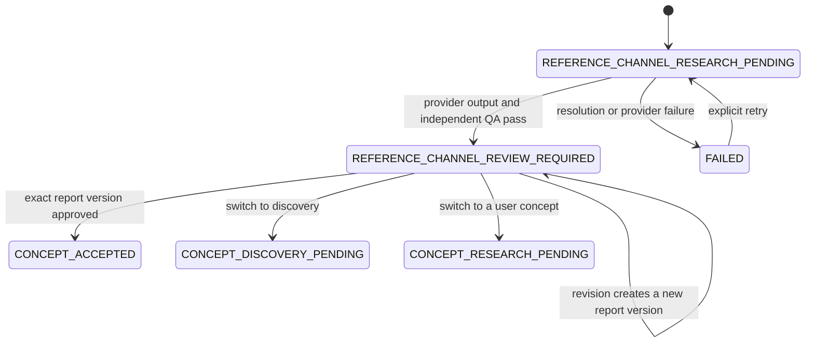

# Reference-channel workflow

`REFERENCE_CHANNEL` is the third onboarding mode. The user supplies a supported YouTube handle, channel, custom, or user URL plus optional inspiration and do-not-imitate notes. Channelwright canonicalizes only allowlisted YouTube hosts and paths; video URLs, short links, credentials, ports, non-HTTP protocols, and lookalike hosts are rejected before orchestration.

The deterministic fixture provider produces a contract-complete report, but it does not call YouTube, retrieve videos or transcripts, or establish current market evidence. Fixture sources, unknowns, confidence, access warnings, and incomplete-data warnings remain visible in every report version. A future live adapter must implement `ReferenceResearchProvider`, use legally accessible public data, and return the same validated contract.

Reports are immutable versions. Section-level change instructions create a child version and rerun independent QA. Approval records the exact current version separately; stale approval is rejected. The user may reject the direction or switch onboarding modes without deleting the reference history.

Reference channels are inspiration only. Reports explicitly prohibit copying protected names, logos, artwork, thumbnails, scripts, products, and distinctive trade dress. Fixture recommendations are original placeholders, not transformations of retrieved reference content.

## Production boundary

The workflow is verified only through the JSON fixture repository. Outside mock mode, `/api/workflows` still returns HTTP 501 because the transactional Supabase repository and live YouTube research adapter are not enabled. The migration defines the relational/RLS direction but has not been applied to or verified against a live Supabase project.
