# Video workflow

The implemented video slice begins only after a channel reaches `READY_FOR_VIDEO_PRODUCTION`, which now requires exact-version approval of the connected three-fundamentals strategy. A Pillar Video is a special video project bound to that approved strategy version; it preserves the same research, script, QA, revision, approval, and distribution behavior as a standard video.

```mermaid
stateDiagram-v2
  [*] --> DRAFT
  DRAFT --> STRATEGY_PENDING
  STRATEGY_PENDING --> RESEARCH_PENDING
  RESEARCH_PENDING --> SCRIPT_PENDING
  SCRIPT_PENDING --> SCRIPT_QA_PENDING
  SCRIPT_QA_PENDING --> SCRIPT_REVIEW_REQUIRED
  SCRIPT_QA_PENDING --> SCRIPT_PENDING: QA revision
  SCRIPT_REVIEW_REQUIRED --> SCRIPT_PENDING: Human requests changes
  SCRIPT_REVIEW_REQUIRED --> SCRIPT_APPROVED: Human approves
  SCRIPT_PENDING --> SCRIPT_QA_PENDING: New immutable version
  SCRIPT_APPROVED --> PLATFORM_PLAN: Selected fixture targets only
  SCRIPT_APPROVED --> RENDER_INPUT: Human queues exact script and assets
  RENDER_INPUT --> RENDER_QUEUED
  RENDER_QUEUED --> RENDER_LEASED: Isolated worker claims
  RENDER_LEASED --> RENDER_QUEUED: Lease expires and retry remains
  RENDER_LEASED --> MASTER_QA_BLOCKED: Stored MP4 inspected; one or more gates unknown/fail
  RENDER_LEASED --> MASTER_REVIEW: All six QA categories pass
  MASTER_REVIEW --> EXPORT_READY: Human approves exact master version
  PLATFORM_PLAN --> PLATFORM_QA
  PLATFORM_QA --> PLATFORM_REVIEW: PASS
  PLATFORM_QA --> PLATFORM_FAILED: REVISE
  PLATFORM_REVIEW --> PLATFORM_APPROVED: Exact-version approval
  PLATFORM_REVIEW --> PLATFORM_PLAN: Requested changes create new version
```



Content strategy establishes the viewer, angle, promise, thesis, hook, sections, and risks. Research stores claims with source IDs, contradictions, unknowns, and copyright concerns. The script is structured into a hook and timed sections with claim references. A separate QA contract returns PASS or REVISE with machine-readable findings.

Approval events reference the exact script version. Requesting changes records feedback, produces a new script version, reruns QA, and returns to human review.

Each video freezes its channel's distribution targets at creation. YouTube is mandatory. After script approval, a YouTube-only video creates no platform child artifacts; selected TikTok and Reels targets create distinct, versioned fixture adaptation plans. Each plan references the approved script version, carries a null master version, runs independent platform QA, and requires human approval of the exact artifact version. A platform failure does not change the approved script or sibling platform records.

## Local rendering proof

`ChannelwrightMaster` is the first deterministic local Remotion composition. It validates provider-neutral render input, calculates its duration from timed scenes, and can render a short 1920×1080, 30 FPS MP4 without external APIs or downloaded assets. The server renderer remains an explicit background-worker boundary under `src/server/rendering`; no normal Next.js request invokes it.

```powershell
npm.cmd run video:studio
npm.cmd run video:render:sample
npm.cmd run video:ffprobe -- renders/deterministic/channelwright-sample.mp4
```

These evidence levels are intentionally distinct:

1. **Deterministic local test rendering** proves that the composition, validated sample input, Remotion bundle, and local encoder work on the tested machine.
2. **Provider-generated assets** would be separately created narration, images, footage, or music referenced by stable asset identifiers. No such provider integration exists in this slice.
3. **Inspected rendered media** means an actual output file was probed and its container, streams, dimensions, frame rate, duration, and size were recorded. A filename or successful workflow record is not media inspection.
4. **Upload/publishing readiness** additionally requires durable object storage, rights and content QA, provider OAuth, platform-specific validation, upload adapters, and verified publishing results. Local rendering does not clear those gates.

The original deterministic sample remains silent. The audio sample uses a generated mono WAV test signal and proves loading, timing, fades, gain, AAC output, and technical measurement locally. Render inputs can reference versioned narration and music, enforce trim/range/non-overlap rules, and apply deterministic narration ducking to music. A worker resolves only owned, `READY`, rights-`VERIFIED`, checksum-matching private asset versions.

Production masters begin `QA_BLOCKED` unless the latest report in all six categories passes. Technical inspection records container, codecs, stream counts, dimensions, frame rate, pixel format, duration, size, audio rate/channels, loudness, peaks, silence ratio, and SHA-256. Rights, content/claims, visual, subjective audio, platform QA, and exact-version human approval are not inferred from those measurements.

No live media-generation provider, production worker deployment, OAuth application, platform upload, publishing operation, or post-publish verification has been exercised. Optional platform plans remain adaptation plans with `sourceMasterVersion: null`; a YouTube master cannot silently convert them into media artifacts.
