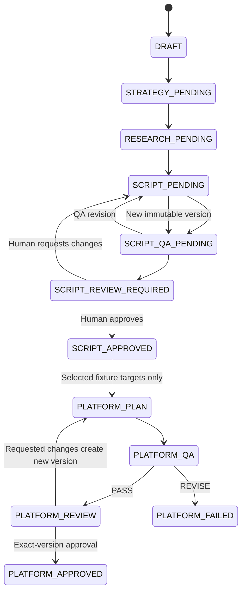

# Video workflow

The implemented video slice begins only after a channel reaches `READY_FOR_VIDEO_PRODUCTION`, which now requires exact-version approval of the connected three-fundamentals strategy. A Pillar Video is a special video project bound to that approved strategy version; it preserves the same research, script, QA, revision, approval, and distribution behavior as a standard video.

Content strategy establishes the viewer, angle, promise, thesis, hook, sections, and risks. Research stores claims with source IDs, contradictions, unknowns, and copyright concerns. The script is structured into a hook and timed sections with claim references. A separate QA contract returns PASS or REVISE with machine-readable findings.

Approval events reference the exact script version. Requesting changes records feedback, produces a new script version, reruns QA, and returns to human review.

Each video freezes its channel's distribution targets at creation. YouTube is mandatory. After script approval, a YouTube-only video creates no platform child artifacts; selected TikTok and Reels targets create distinct, versioned fixture adaptation plans. Each plan references the approved script version, carries a null master version, runs independent platform QA, and requires human approval of the exact artifact version. A platform failure does not change the approved script or sibling platform records.

Voice, assets, master rendering, thumbnails, object storage, media inspection, OAuth, direct publishing, and analytics remain outside this slice. Consequently, an approved platform plan is still not rendered, export-ready, or publish-ready.
